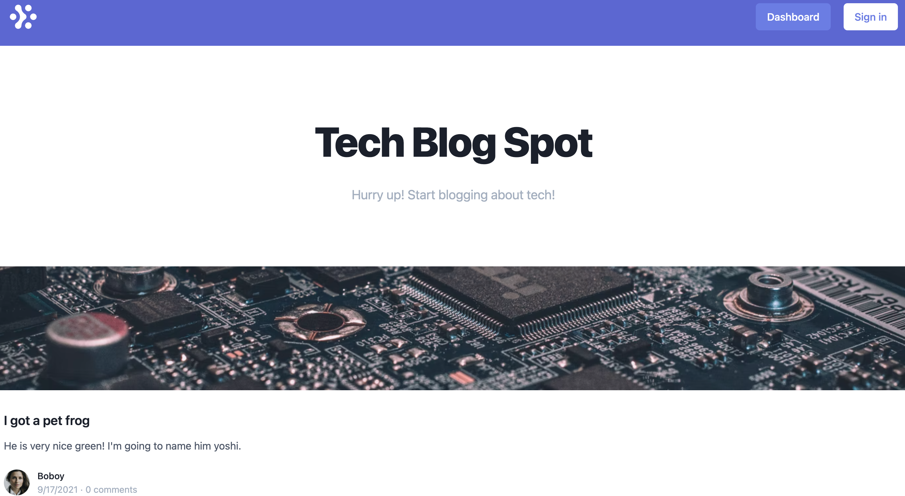

# <ins>Tech Blog Spot</ins>

## <ins>Description</ins>

Tech Blog Spot is a full-stack web application that allows users to create, edit, and delete blog posts.

## <ins>Table of Contents</ins>

- [Installation](#installation)
- [Usage](#usage)
- [License](#license)
- [Features](#features)
- [Contributions](#contributions)
- [Tests](#tests)
- [Questions](#questions)

## <ins>Installation</ins>

npm i, mysql

## <ins>Usage</ins>

AS A developer who writes about tech
I WANT a CMS-style blog site
SO THAT I can publish articles, blog posts, and my thoughts and opinions

### [Check out demo!](https://tranquil-ridge-84276.herokuapp.com/)

## <ins>License</ins>

This project is covered under MIT

## <ins>Features</ins>

- I am presented with the homepage, which includes existing blog posts if any have been posted; navigation links for the homepage and the dashboard; and the option to log in

- I am able to delete or update my post and taken back to an updated dashboard

- I am able to view comments but I am prompted to log in again before I can add, update, or delete comments

## <ins>Contributions

xBOBOYx

## <ins>Tests</ins>

no testing done

## <ins>Questions</ins>

Contact BOBOY at boboy.zamora@gmail.com. Github link: https://github.com/xBOBOYx